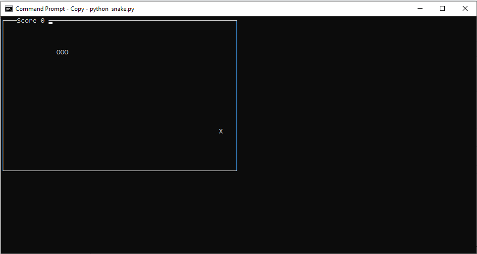

# snake-python-terminal
This application is a snake game made with python that runs in the terminal.
It uses the curser library. On most systems this library comes by default. 
if you are on windows you need to intall it. Run the command "pip install windows-curses"
in the terminal. You need python on your machine to run this game. This game does not run 
well in the terminal of IDE's. It's recomended you run this application through the command prompt.
If given an error about line space zoom out of the terminal with "ctrl + scroll out". To run this 
game go to the python directory in the terminal and run "python snake.py".

Game Intructions: 
-Use the arrow keys to move.
-Space bar to pause.
-Esc to exit.
-Hold arrow key to speed up.

